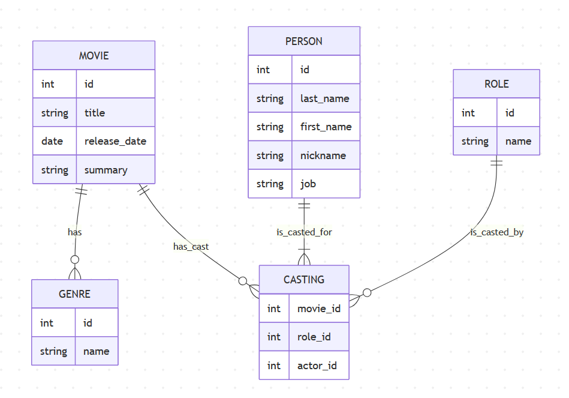

# Filmographie

Filmographie est une API REST Spring Boot conçue pour centraliser la gestion d’un catalogue cinématographique.  
Le projet permet de manipuler les données principales d’une filmographie (films, genres, personnes, rôles) et de modéliser précisément la relation de **casting** entre ces entités.

## Technologies

- Java 25
- Spring Boot 4
- Spring MVC
- Spring Data JPA
- PostgreSQL
- MapStruct
- Lombok
- Springdoc OpenAPI (Swagger UI)
- Maven

## Arborescence

Le code est organisé par domaine métier dans `src/main/java/fr/esgi/filmographie/` :

- `movie/` : gestion des films
- `genre/` : gestion des genres
- `person/` : gestion des personnes
- `role/` : gestion des rôles
- `casting/` : gestion des castings
- `config/` : configuration globale (`GlobalExceptionHandler`, `OpenApiConfig`)
- `logging/` : aspect/filter de logs

Tests dans `src/test/java/fr/esgi/filmographie/`.

## Base de données



## Prérequis

- JDK 25
- Maven (ou wrapper Maven fonctionnel)
- PostgreSQL accessible en local

## Configuration

Configuration principale : `src/main/resources/application.properties`

Exemple actuel :

- `server.servlet.context-path=/api`
- `spring.datasource.url=jdbc:postgresql://localhost:5432/filmographie`
- `spring.datasource.username=postgres`
- `spring.datasource.password=postgres`
- `spring.jpa.hibernate.ddl-auto=update`

Adapte ces valeurs selon ton environnement.

## Lancer le projet

Avec Maven installé :

```powershell
docker compose up -d
mvn spring-boot:run
```
